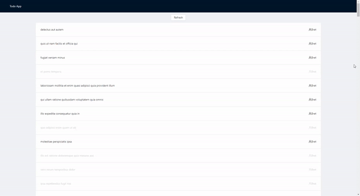

# React App with graphql + ts

React app example with data fetching by graphql

> Actual for October 2020 implementation

- api source: https://graphqlzero.almansi.me/



## Tech stack
- **UI**: `react`, `antd`, `classnames`
- **Lang**: `typescript` (3.7+)
- **Fetching**: `graphql`, `apollo-client`
   - **API Codegen**: `graphql-codegen`
- **Routing**: `react-router`

---

## Usage

### Start local stand

```bash
# install deps
npm i
# run stand
npm run start
```

### Generate api
```bash
# update local api once
npm run api:gen
# update by changes (watch)
npm run api:gen--watch
```

### (IN PLAN) Run linter
```bash
npm run lint:fix
```

### (IN PLAN) Run tests
```bash
# Run all tests
npm run test
# Run unit tests
npm run unit
# Run lint tests
npm run lint
```

---

## Structure

- [STRUCTURE.MD](/STRUCTURE.md)

## Recommendations

- [RECOMMENDATIONS.MD](/RECOMMENDATIONS.md)

## FAQ

- Q: ~~Show me~~ code!
- A: [pages/tasks-list](https://github.com/martis-git/example-graphql-react-typescript/blob/dev/src/pages/tasks-list/index.tsx)
